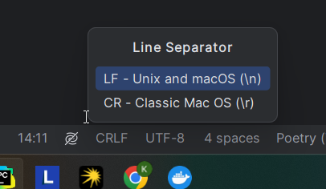

### How will i launch the project ?
1) Clone repository
2) For next step you should have docker daemon on Unix or dokcer desktop on Windows OS. 
So write in terminal `docker compose up -d`
3) Then start `main.py` for executing example func and find in 
root directory file by named result.json
4) Or you can start testing using command `docker compose exec -T
workers bash config/scripts/testing.sh`, but don't forget to start docker
orchestration `docker compose up -d`, if you didn't it before.

I got one mistake that been drinking my blood. When you clone a repository, 
line separator in Windows named 'CRLF' change separators in all files, and files like .sh too, 
which using in Docker for start testing or start celery workers scripts. 

If it happens, i'm not sure, how it change. In pycharm it do easy, but in other case. I don't know
